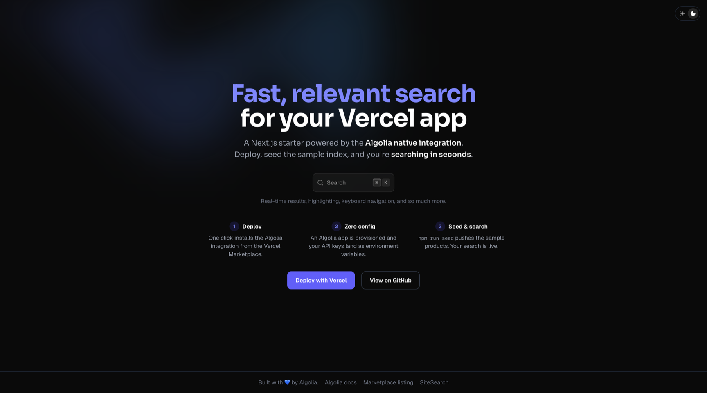

# Algolia Vercel Starter

A minimal [Next.js](https://nextjs.org) starter showing how to use [Algolia](https://www.algolia.com)
with the [Algolia integration on the Vercel Marketplace](https://vercel.com/marketplace/algolia-production).
Deploy it, seed the sample products, and you have a full search experience —
search-as-you-type, highlighting, keyboard navigation (<kbd>⌘K</kbd>) — powered by
[SiteSearch](https://sitesearch.algolia.com) components built on
[React InstantSearch](https://www.algolia.com/doc/guides/building-search-ui/what-is-instantsearch/react/).



**Live demo:** _coming soon_

## Deploy your own

Deploying this starter with the button below installs the Algolia integration on your new
project. It provisions an Algolia app and injects the API keys as environment variables —
no manual configuration needed.

[](https://vercel.com/new/clone?repository-url=https%3A%2F%2Fgithub.com%2Falgolia%2Falgolia-vercel-starter&project-name=algolia-starter&repository-name=algolia-vercel-starter&stores=%5B%7B%22type%22%3A%22integration%22%2C%22integrationSlug%22%3A%22algolia-production%22%2C%22productSlug%22%3A%22application%22%7D%5D)

After the first deploy, seed the sample data once:

```bash
git clone https://github.com/<your-account>/algolia-vercel-starter && cd algolia-vercel-starter
npm install
npx vercel link         # link to the project you just deployed
npx vercel env pull .env.local
npm run seed            # pushes data/products.json to the starter_products index
```

Reload your deployment — search is live.

## How it works

The integration injects three environment variables into the Vercel project:

| Variable | Purpose | Browser-safe? |
| --- | --- | --- |
| `ALGOLIA_APP_ID` | Identifies your Algolia application | ✅ exposed as `NEXT_PUBLIC_ALGOLIA_APP_ID` |
| `ALGOLIA_SEARCH_API_KEY` | Search-only key used by the frontend | ✅ exposed as `NEXT_PUBLIC_ALGOLIA_SEARCH_API_KEY` |
| `ALGOLIA_WRITE_API_KEY` | Indexing key used by `npm run seed` | ❌ server-side only, never exposed |

The browser-safe values are mapped in [`next.config.ts`](next.config.ts) via the `env` key.
The write key is deliberately **not** mapped.

- [`app/page.tsx`](app/page.tsx) — landing page rendering the search experience
- [`components/search.tsx`](components/search.tsx) — SiteSearch component (`algoliasearch` lite client + `react-instantsearch`)
- [`data/products.json`](data/products.json) — 20 sample products
- [`scripts/seed.mjs`](scripts/seed.mjs) — idempotent seed script targeting the `starter_products` index

## Local development

```bash
git clone https://github.com/algolia/algolia-vercel-starter && cd algolia-vercel-starter
npm install
npx vercel link          # link to a Vercel project with the Algolia integration installed
npx vercel env pull .env.local
npm run seed             # idempotent — safe to re-run
npm run dev
```

Open [http://localhost:3000](http://localhost:3000) and hit <kbd>⌘K</kbd>.

## Learn more

- [Algolia documentation](https://www.algolia.com/doc/)
- [Algolia on the Vercel Marketplace](https://vercel.com/marketplace/algolia-production)
- [SiteSearch component registry](https://sitesearch.algolia.com)
- [React InstantSearch](https://www.algolia.com/doc/guides/building-search-ui/what-is-instantsearch/react/)

## License

[MIT](LICENSE)
